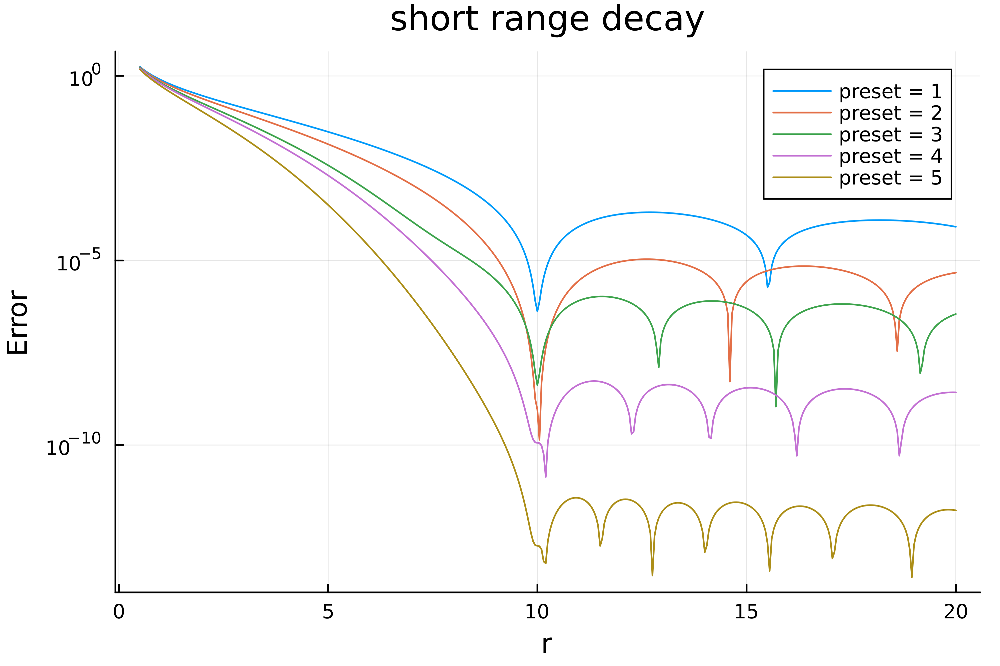
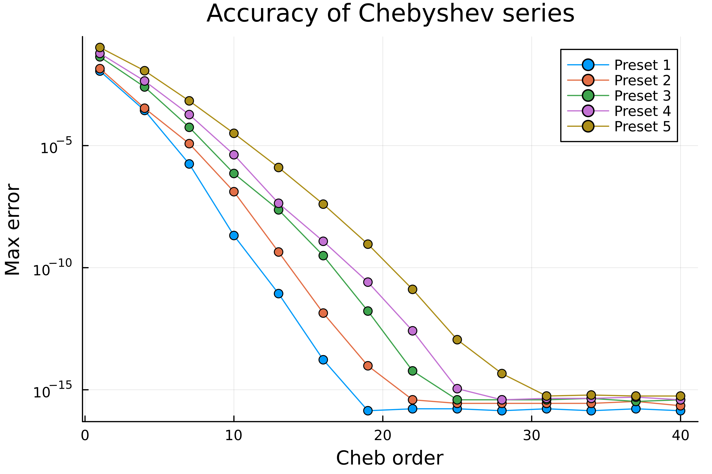
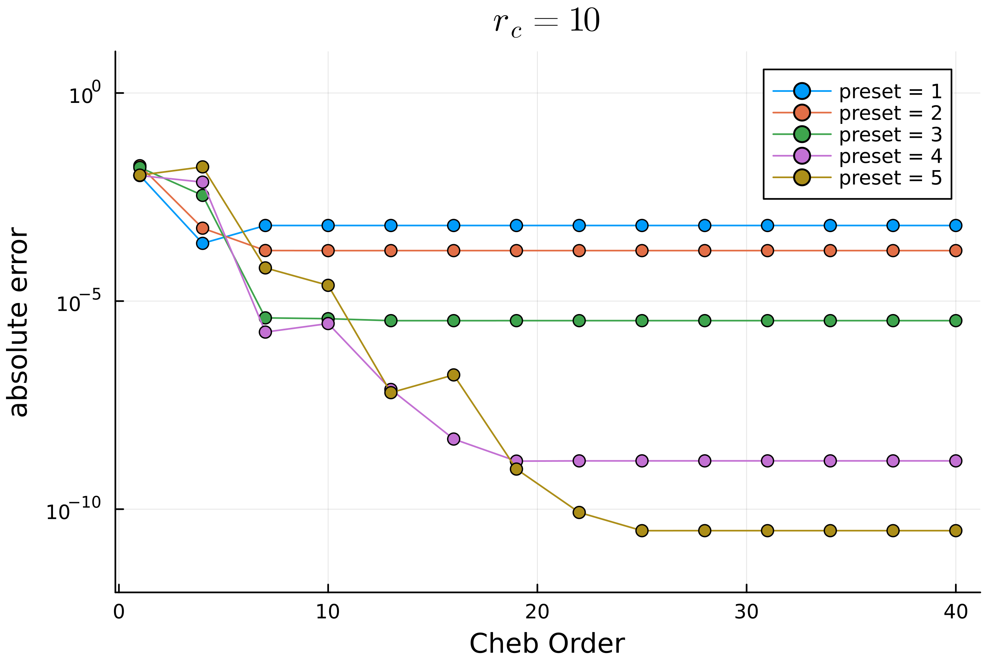
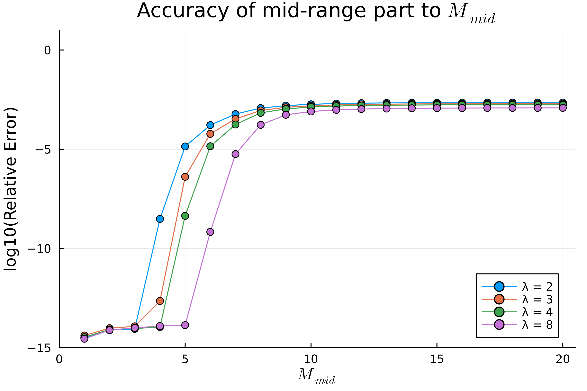
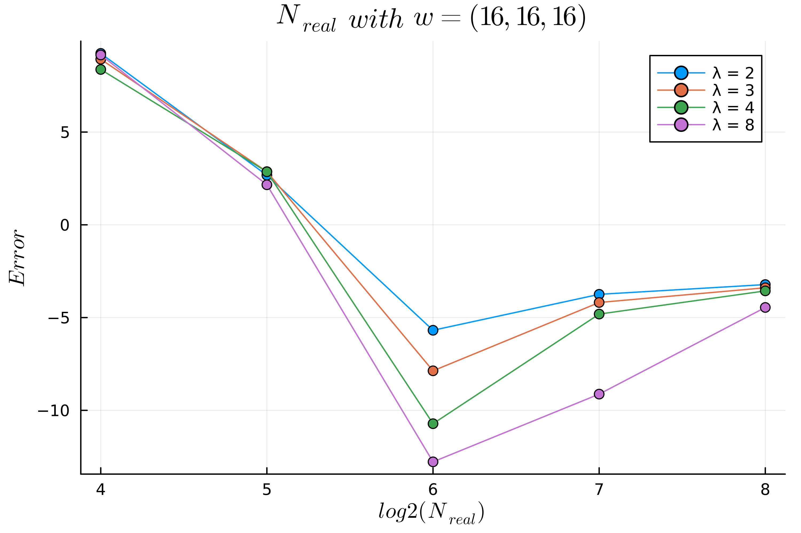
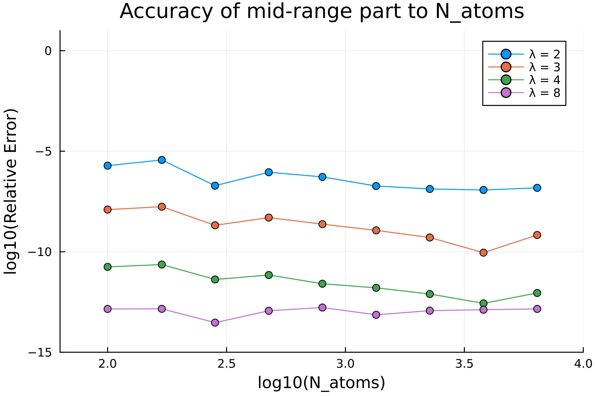

# Accuracy Results

Summarize the accuracy results, for parameters choosing.

## Short-range part

In caluculation of the short-range part interaction energy, the following approximations are applied
* Sum of Gaussians approximation for Coulomb kernel
* Chebyshev interpolation for the sum of Gaussians
* real space cutoff

The following figure shows the decaying rate of short range interaction with different preset parameters.
For all five cases, the absolute error decay to minimum at $r_c = 10$ as expected, which is a proper short range cutoff.

To verify that, we take a random system, assume that there are $1000$ particles in the system, we can find that the error of total short-range interaction energy vary as follow.
Here we compared the summation error of different cutoffs, comparing to the case where $r_c = L / 2$, where $L$ is the box length.
The results indicate that the error is minimized when $r_c = 10$.

The minimum error corresponding to different sets are listed below:

Tabel 1, Short range cheb order for different preset parameters

|  preset   | Minimum error |
|  :----:  | :----:  |
| 1  | 1e-3 |
| 2  | 1e-4 |
| 3  | 1e-6 |
| 4  | 1e-9 |
| 5  | 1e-11 |

To further reduce the cost of calculating the short range part, we can use the Chebyshev interpolation to approximate the sum of Gaussians.
The error is given as below, which indicates that terms of Chebyshev polynomial to reach the high accuracy on this finite region $x \in [0.5, 10]$ is much smaller that the naive summation.

Then fix cutoff as $r_c = 10$, we can compare the error of Chebyshev interpolation with different number of terms.
It is shown that with a low order of Chebyshev polynomial, the error is fine, and the correspond parameters are given in the form.

Tabel 1, Short range cheb order for different preset parameters

|  preset   | Short-range Cheb Order  |
|  :----:  | :----:  |
| 1  | 6 |
| 2  | 8 |
| 3  | 10 |
| 4  | 20 |
| 5  | 26 |

## Mid-range Part

For the mid-range part, we applied Particle-mesh with 3D FFT.
In that case, there are a few important parameters
* Grid size
* size of the compact support of the kernel
* extra padding ratio in z
* bandwidth of the kernel

### Relation between padding ratio / bandwidth and error

In the following cases, we set the $L_x = L_y = L_z = 100$, $N_{atoms} = 100$ and $\beta = 5w$.

The following figure shows the relation between the padding ratio and the error of the mid-range part.
Here we used the second set of parameters as an example, and the error is calculated as the difference between the mid-range part energy calculated by the FFT and the direct summation.
We fixed $N_{real} = (128, 128, 128)$ and $w = (16, 16, 16)$.
Thus, to reach a high accuracy, we can take $M_{mid} = 6$ and $\lambda = 2$, which gives an error of about $10^{-6}$.

The relation between the gird size and the error with different padding rate is shown below, which indicates that in that case, the error is minimized when $N_{grid} = 64$ for all padding rate.

Based on that, we can see that for $N_{atoms} = 100$, with the 2nd set of parameter (accuracy: 1e-4), we can set $N_{grid} = 64$, $M_{mid} = 6$, $\lambda = 2$, $w = (16, 16, 16)$ to reach a high accuracy.

The following result shows the error of the mid-range part with different system size, where we increase the number of atoms from $100$ to $6400$, and fixed the density and $N_{grid} / L$ unchanged, and $w = (16, 16, 16)$ for all cases.
The results shows that as the system size increases, the error of the mid-range part is fixed, which is expected.

